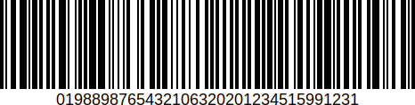

## hmBC_Generate Barcode (Info) → Status
###### Introduced in v18, Preemptive: yes

|Parameter|Type|In/Out|Description
|---|---|:---:|---
|Info|Object|→|Info object
|Status|Object|←|Status object

### Description
The command *hmBC_Generate Barcode* generates a barcode with the information from the *Info* parameter.
Attributes of the Info-object:

- *text* (Text, mandatory): text of the barcode to decode
- *symbology* (Integer, optional): type of the barcode, default is *Code 128* if not passed
- *option1* (Integer, optional): option 1 (see demo database for possible values) 
- *option2* (Integer, optional): option 2 (see demo database for possible values) 
- *option3* (Integer, optional): option 3 (see demo database for possible values) 
- *showtext* (Boolean, optional): shows a human readable text below the barcode, if supported
- *mode* (Integer, optional): decode mode (default is *hmBC_Input_Data Mode* if not passed), you can use the following constants:
    - *hmBC_Input_Data Mode*
    - *hmBC_Input_Unicode Mode*
    - *hmBC_Input_GS1 Mode*
    - *hmBC_Input_Escape Mode*
- *primary* (Text, optional): additional text, depends of the barcode, see demo database.
- *output* (Text, optional, default = "svg"):
    - *"svg"*: Status object returns a SVG picture
    - *"matrix"*:  Status object returns matrix-text with 0, 1 and comma drawing information


*Status* returns an object with the result or possible errors:

- *picture* (Picture): SVG-picture of the barcode or **Null** if an error occurs. *output* must be "svg"
- *matrix* (Text): drawing information of the barcode: 0 (white), 1 (black) and comma (next line). *output* must be "matrix"
- *error* (Integer): error code, 0 if success
- *error_text* (Text): error text
- *success* (Boolean): **True** if the creation was successful

### Example
The following example creates a QR Code picture and saves it to disk:

```4d
var $vo_status; $vo_barcode : Object

$vo_barcode:=New object
$vo_barcode.text:="this is a demo text"
$vo_barcode.symbology:=hmBC_QR Code

$vo_status:=hmBC_Generate Barcode($vo_barcode)

If ($vo_status.success)
	WRITE PICTURE FILE("test.svg"; $vo_status.picture)
End if 
 ```

Result:


The following example creates a GS1-128 Barcode:

```4d
var $vo_status; $vo_barcode : Object

$vo_barcode:=New object
$vo_barcode.showtext:=True
$vo_barcode.mode:=hmBC_Input_GS1 Mode
$vo_barcode.text:="[01]98898765432106[3202]012345[15]991231"
$vo_barcode.symbology:=hmBC_GS1 128

$vo_status:=hmBC_Generate Barcode($vo_barcode)

If ($vo_status.success)
	WRITE PICTURE FILE("test.svg"; $vo_status.picture)
End if 
```

Result:


